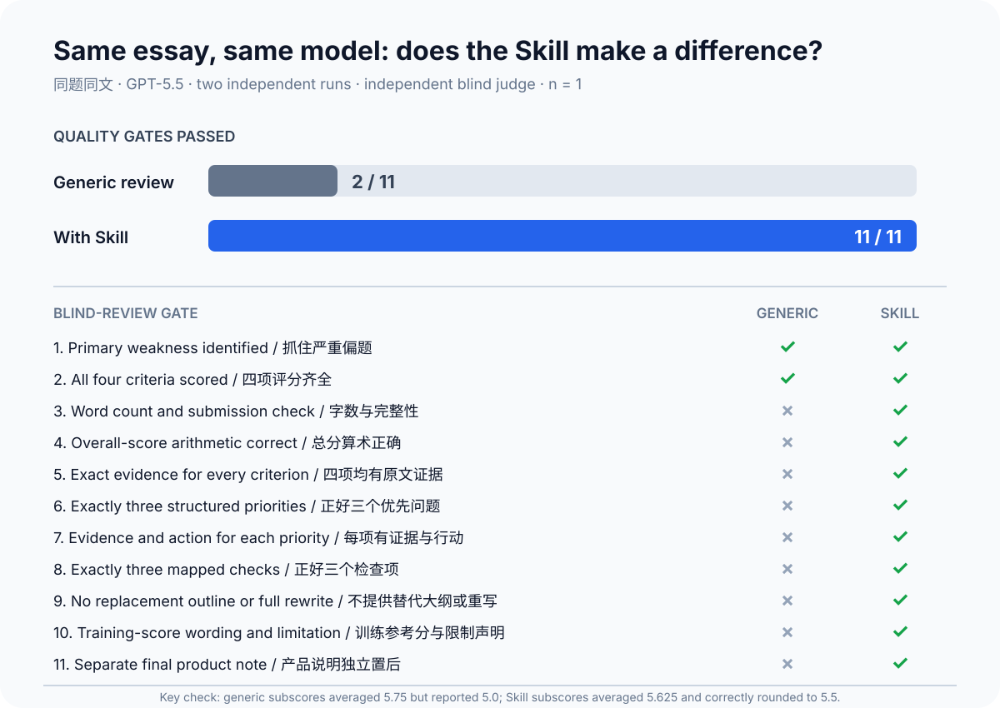

# IELTS Task 2 写作批改器

[English README](README.md)

一套可以重复使用的通用 Prompt 和 Codex Skill：批改单篇 IELTS Writing Task 2 作文，引用真实原文证据，并找出下一稿最值得优先解决的三个问题。

版本：`1.0.0`



*单篇受控对比：使用同一道题、同一篇作文、同一个GPT-5.5模型，并由独立会话盲评。`n = 1`，用于展示批改规则带来的稳定性，不代表对所有作文的评分准确率。*

## 为什么做这个工具

普通 AI 批改经常给出一个分数、一长串错误和一篇重写范文，但用户看完后不一定知道下一篇具体应该练什么。

这个批改器采用更聚焦的规则：

1. 检查 IELTS Writing 四项标准；
2. 每个主要判断都引用作文原文；
3. 只选择影响最大的三个问题；
4. 把三个问题转化成下一稿检查项；
5. 不替用户重写整篇作文。

## 仓库提供什么

- 英文通用 Prompt；
- 中文界面的通用 Prompt；
- 可安装的 Codex Skill；
- 一篇原创示例作文和完整批改；
- 十篇原创评测作文；
- 公开的评测记录和验证脚本。

免费版不限使用次数，没有作文次数限制、到期时间、在线激活或故意降低质量的试用版。

## 60秒开始使用

### ChatGPT或其他支持长Prompt的AI工具

打开其中一个文件：

- [英文Prompt](prompts/task2-reviewer-en.md)
- [中文界面Prompt](prompts/task2-reviewer-zh.md)

复制文件中 `Prompt` 代码块的全部内容，再提交完整的Task 2题目和作文。

### Codex

克隆仓库后，将Skill复制到个人Skill目录：

```bash
mkdir -p "$HOME/.agents/skills"
cp -R codex-skill/ielts-task2-reviewer "$HOME/.agents/skills/ielts-task2-reviewer"
```

调用示例：

```text
Use $ielts-task2-reviewer to review this Task 2 question and essay. Explain the feedback in Chinese.
```

项目级安装和故障处理请查看[完整快速入门](docs/quick-start.zh-CN.md)。

## 示例

作文原句：

> Educated people are useful, and every country needs useful people.

批改结果：

> **Problem:** 观点相关，但发展不足。
>
> **Why this is a priority:** 文章提出了合理方向，却没有解释中间机制。
>
> **Next-draft action:** 具体解释免费大学教育怎样带来社会或经济收益。

查看[原创示例作文](examples/sample-essay.md)和[完整批改结果](examples/sample-review.md)。

## 完整输出

每次完整批改包含：

- Submission Check；
- Training Reference Score Summary；
- Task Response；
- Coherence and Cohesion；
- Lexical Resource；
- Grammatical Range and Accuracy；
- Three Priority Problems；
- Next-Draft Checklist；
- Scoring Limitation。

所有分数均为AI生成的训练参考分，不是官方IELTS成绩。

## 质量与评测

中英文最终Prompt分别测试了十种原创案例：

- 偏题；
- 观点发展不足；
- 例子不能支持观点；
- 段落推进混乱；
- 机械使用连接词；
- 词汇重复；
- 搭配错误；
- 频繁语法错误；
- 语言简单但表达清楚；
- 接近目标水平。

最终20份Prompt输出在看不到预期诊断的情况下生成，并通过了结构、精确原文证据、问题数量、免责声明和意外重写标题等自动检查。人工复核中，中英文分别有9/10案例命中预设的主要弱点，且没有出现整篇重写。Skill也在三个代表性案例上完成了全新上下文测试。

查看[评测标准](evals/evaluation-rubric.md)、[机器可读结果](evals/results.json)、[Prompt运行记录](evals/run-log.md)和[Skill前向测试](evals/skill-forward-test.md)。

## 评分依据和边界

批改结构参考当前公开的IELTS Writing四项标准说明。项目只使用原创表述，不复制商业教学资料或完整官方评分表。

来源与限制记录在[评分依据与限制](docs/scoring-disclaimer.zh-CN.md)。

本项目与IELTS、British Council、IDP和Cambridge University Press & Assessment不存在隶属或官方背书关系。

## 免费版与完整版

免费版永久免费处理单篇作文诊断。未来的独立完整版计划增加审题、错题卡、针对性练习、跨作文错误追踪、每周复盘和Notion错题本。

完整版仍在开发中。查看[透明功能对照](docs/full-version.zh-CN.md)。

## 使用条款

本项目仅授权个人非商业使用。禁止转卖、共享、公开再上传、重新打包，或使用本产品提供收费批改、辅导及其他盈利服务。

使用或修改前请阅读[LICENSE.md](LICENSE.md)。
